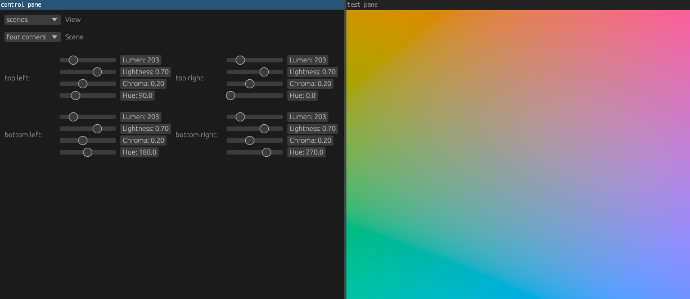

# wayland-color-test

This application can be used to test the color management implementation of
wayland compositors.

Prerequisites:

- The compositor must support the color management protocol.
- The vulkan driver must support R16G16B16A16_SFLOAT with the PASS_THROUGH_EXT
  color space. (Mesa 25.1)

